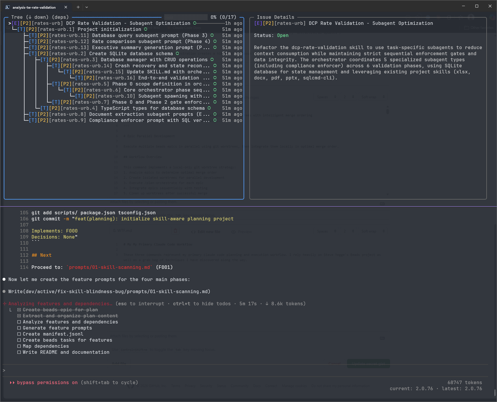

# Planning System

A Claude Code plugin for planning and executing complex features with reliable verification.



## What It Does

Break large features into smaller pieces, then execute them one by one - with built-in verification that ensures each piece is actually complete before moving on.

Uses Beads as the source of truth for plans and task state. Pull-based execution means you work on one task at a time, with quality gates enforced by hooks.

## Install

**Prerequisites:** [Bun](https://bun.sh), [Beads](https://github.com/steveyegge/beads), Git, GitHub CLI

**Optional:**
- [Perles](https://github.com/zjrosen/perles) - Visual tracking UI for Beads
- [Azure CLI](https://docs.microsoft.com/cli/azure/) with [DevOps extension](https://learn.microsoft.com/en-us/azure/devops/cli/) (`az extension add --name azure-devops`) - For Azure DevOps integration (PRs, work item sync)
- `ANTHROPIC_API_KEY` environment variable - For AI-powered test quality verification

```bash
claude plugin marketplace add NotMyself/claude-dotnet-marketplace
claude plugin install plan
```

## Commands

### `plan:new`

Start planning a new feature. Claude will ask questions, help you think through edge cases, and create a structured plan stored in a Beads epic.

```
plan:new
```

### `plan:optimize`

Break your plan into executable features. Creates Beads tasks with full prompts and supporting files.

```
plan:optimize <epic-id>
```

## Typical Session

```
> plan:new

Claude: What feature are you building?

You: I want to add user authentication with OAuth

Claude: [asks clarifying questions, creates plan, stores in Beads epic]

Epic created: auth-oauth-xyz

> plan:optimize auth-oauth-xyz

Claude: [breaks plan into 5 features, creates Beads tasks with prompts]

> bd ready

Available tasks:
  auth-oauth-xyz.1  F001: Setup OAuth types

> bd update auth-oauth-xyz.1 --status=in_progress

[work on the feature...]

> bd close auth-oauth-xyz.1

> bd ready

Available tasks:
  auth-oauth-xyz.2  F002: Implement OAuth flow
```

## Project Configuration

Create `.planconfig` in your project root to configure verification commands:

```yaml
build_command: "npm run build"
test_command: "npm test"
lint_command: "eslint ."
format_command: "prettier --check ."
static_analysis_command: "sonar-scanner"
```

All commands are optional. If not configured, those verification steps are skipped.

## If Something Goes Wrong

Beads tracks all state. Use `bd ready` to see available work, `bd show <task-id>` to review any task.

## License

MIT
